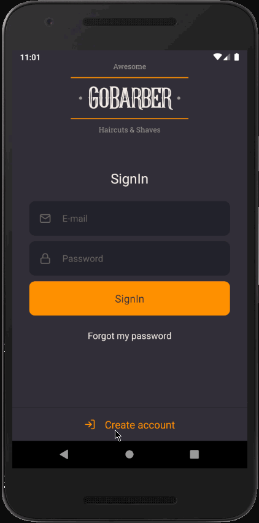

<h2 align="center">
  
</h2>

<p align="center">
  

  

  

  
</p>

<h2>📔 Description</h2>

### App developed for bootcamp GoStack. This is a fullstack application to make appointments for hairstyle

`Application`

<details>
  <summary>See</summary>


</details>

`Mobile`

<details>
  <summary>See</summary>



</details>

<h2>🚀 Technologies</h2>

- [Typescript](https://www.typescriptlang.org/)
- [NodeJS](https://nodejs.org)
- [Express](https://expressjs.com/pt-br/)
- [Postgres](https://www.postgresql.org/)
- [MongoDb](https://www.mongodb.com/)
- [Redis](https://redis.io/)
- [Docker](https://www.docker.com/)
- [Typeorm](https://typeorm.io/#/)
- [Nodemailer](https://nodemailer.com/about/)
- [ReactJS](https://reactjs.org/)
- [React Native](https://reactnative.dev/)
- [React Navigation](https://reactnavigation.org/)
- [React Native Image Picker](https://www.npmjs.com/package/react-native-image-picker)
- [React Native DateTimePicker](https://www.npmjs.com/package/@react-native-community/datetimepicker)
- [Styled Components](https://styled-components.com/)
- [Axios](https://github.com/axios/axios)
- [ESLint](https://eslint.org/)
- [Prettier](https://prettier.io/)
- [Context Api](https://pt-br.reactjs.org/docs/context.html)

---

<h2>❓ How to use</h2>

You need a postgres intence running on 5432 port

`Backend`

```bash
# Clone this repository
$ git clone https://github.com/MarceloHBoff/gobarber2.0/tree/master/backend

# Go into the repository
$ cd gobarber2.0/backend

# Install dependencies for the backend
$ yarn

# Run the backend server
$ yarn dev
```

`Frontend`

```bash
# Clone this repository
$ git clone https://github.com/MarceloHBoff/gobarber2.0/tree/master/frontend

# Go into the repository
$ cd gobarber2.0/frontend

# Install dependencies for the frontend
$ yarn

# Run the frontend
$ yarn start
```

`Mobile`

```bash
# Clone this repository
$ git clone https://github.com/MarceloHBoff/gobarber2.0/tree/master/mobile

# Go into the repository
$ cd gobarber2.0/mobile

# Install dependencies for the mobile
$ yarn

# Start React Native Server in Android
$ yarn android

# Start React Native Server in IOS
$ yarn ios
```

Made with love by [Marcelo Boff!](https://www.linkedin.com/in/marcelo-boff)
